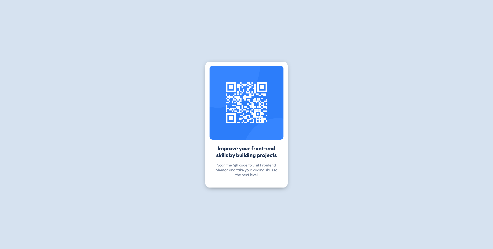

# Frontend Mentor - QR code component solution

This is a solution to the [QR code component challenge on Frontend Mentor](https://www.frontendmentor.io/challenges/qr-code-component-iux_sIO_H). Frontend Mentor challenges help you improve your coding skills by building realistic projects. 

## Table of contents

- [Overview](#overview)
  - [Screenshots](#screenshots)
  - [Links](#links)
- [My process](#my-process)
  - [Built with](#built-with)
  - [Useful resources](#useful-resources)
- [Author](#author)

## Overview

### Screenshot

### Links

- Solution URL: [Add solution URL here](https://your-solution-url.com)
- Live Site URL: [Add live site URL here](https://your-live-site-url.com)

## My process
### Built with

- Simple HTML & CSS
- CSS Flexbox

### Useful resources

- [Box Shadow Generator](https://www.cssmatic.com/box-shadow) - Easiest way to create box-shadows.

## Author

- GitHub - [@joysterr](https://github.com/joysterr)
- Frontend Mentor - [@yjoysterr](https://www.frontendmentor.io/profile/joysterr)